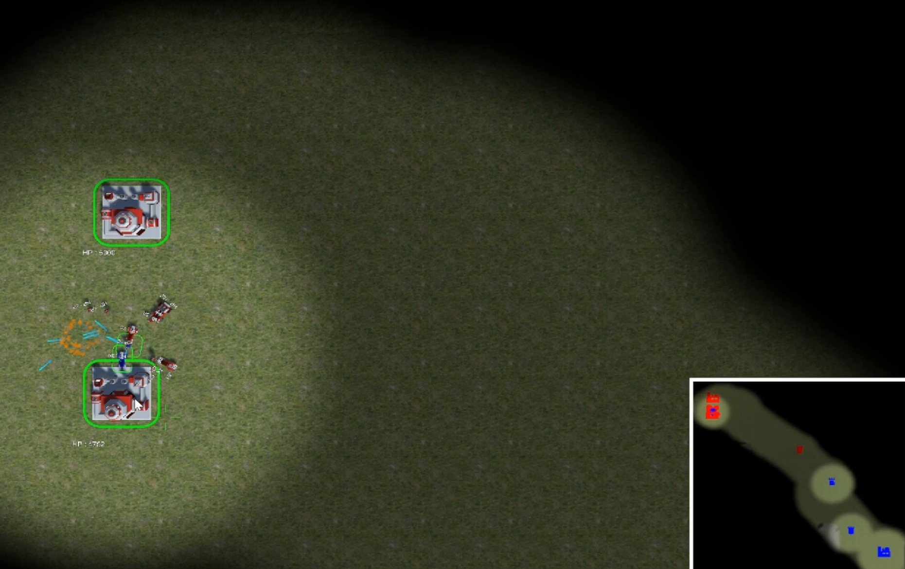
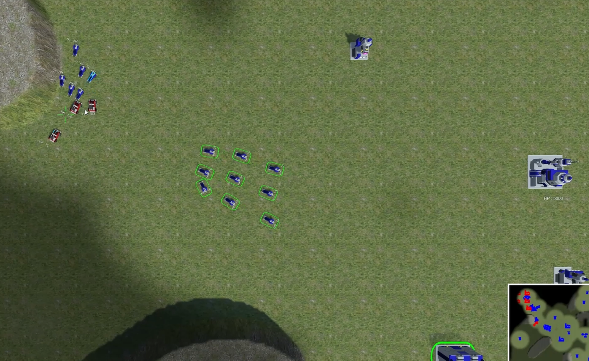
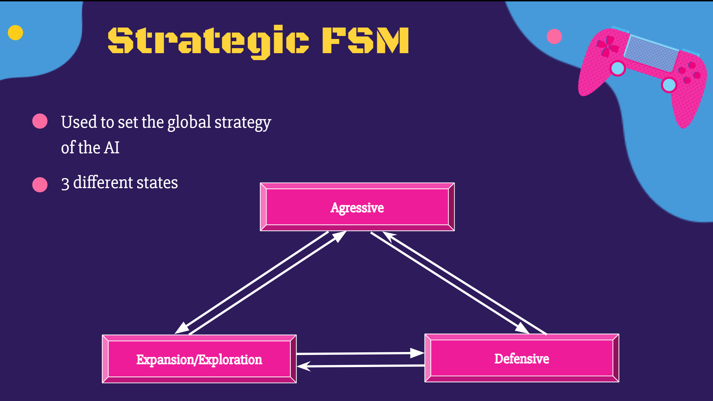
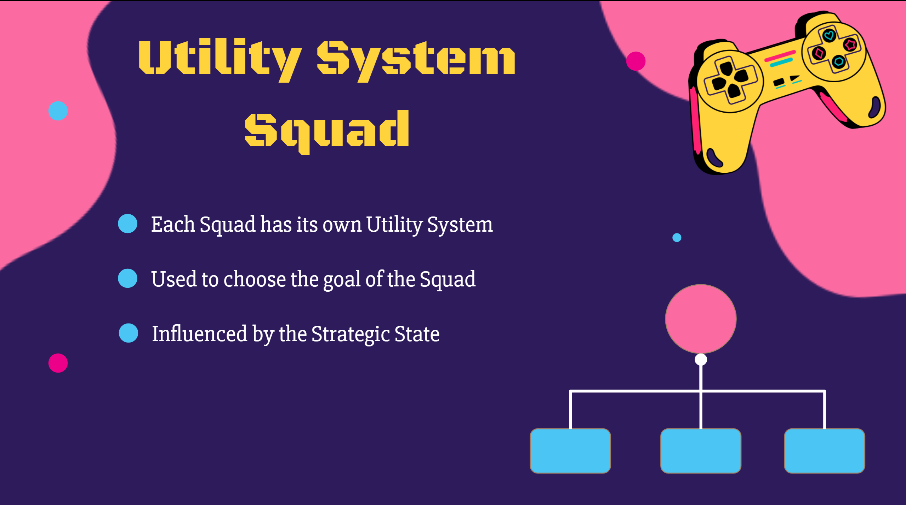
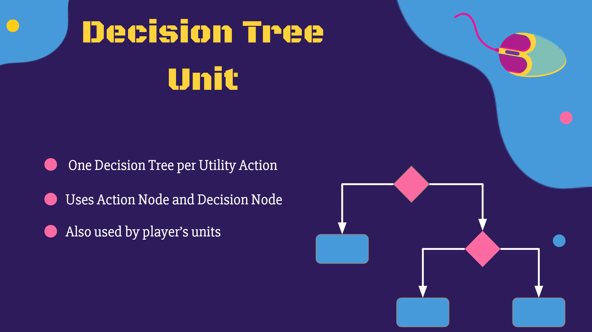
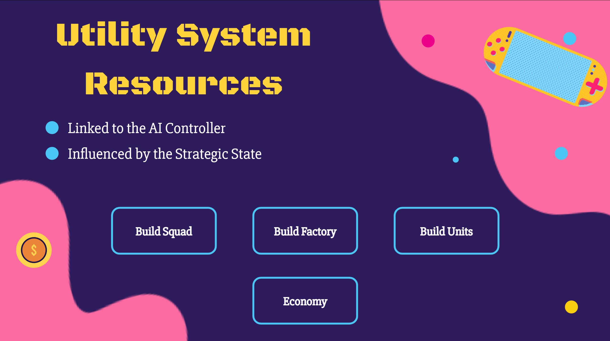
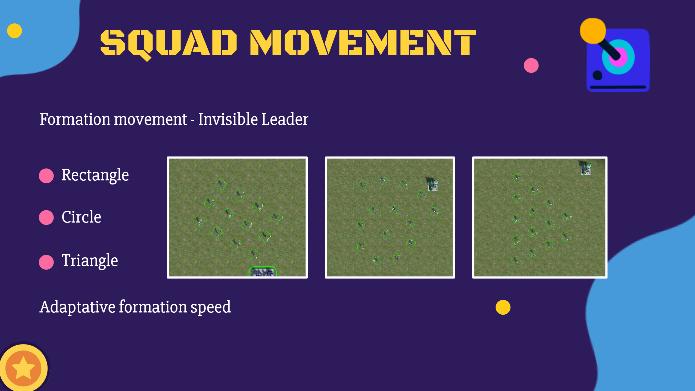
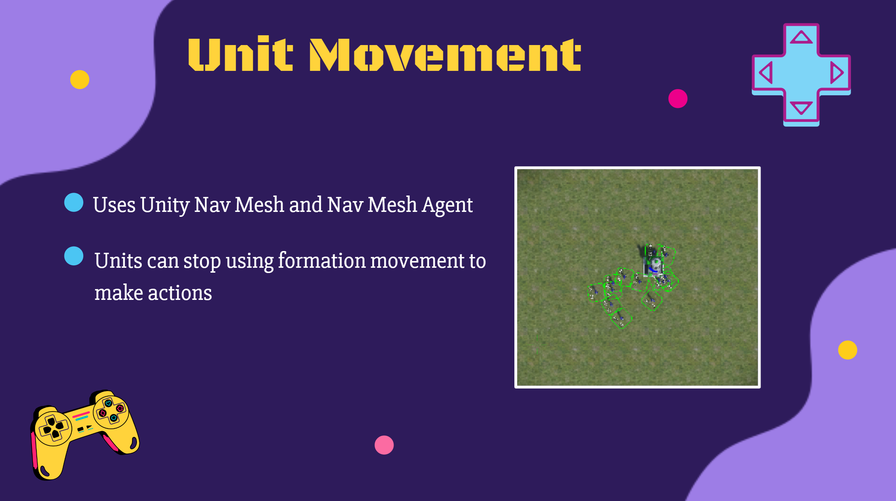

# Real Time Strategy

## Introduction
 `Real Time Strategy` is a game project made on Unity 3D, focused on implementing AI systems to create an RTS Game.  
 This project has been made by **RABINNE Lenny** and **ERBISTI Matéo**, programming students at Isart Digital Paris.  
 Started on `March 18th, 2024` and finished on `April 16th, 2024`.  
 In this project, a template was given to us and we only added code relative to Artificial Intelligence.
 
 

## Description

### Strategic FSM:
Firstly, we implemented a Finite State Machine system to choose the strategic state of our AI. The AI opponent can have one of these three states: Aggressive, Defensive, and Expansion.  
The Finite State Machine will switch from one state to another depending on different parameters of the world state.
 

### Squad Utility System:
Each squad of the AI will choose a goal thanks to its Utility System. We created a Utility System with Goals.   A goal can be to attack an enemy base, defend a base, take over a laboratory, or even attack an enemy squad.  
The Utility System will take into account the Strategic State that will influence the priority of each goal as well as parameters from the world state.  
 

### Unit Decision Tree:
Once a squad has chosen its goal, every unit of the squad will select the right decision tree to make this goal.  
We chose to implement a decision tree for our micromanagement because it's only simple tasks that don't need more than 2 or 3 actions and a decision tree is easy to implement.  
 

### Resource Management Utility System:
For resource management, we chose to reuse the Utility System that we made but with different goals such as CreateSquad, CreateFactory, Economy...  
Resource management will also be influenced by the strategic state and the world state to choose the right goal.  
 

### Formation:
We implemented a two-level steering system formation with an invisible leader to move the squads. The speed of the formation will adapt depending on the unit with the lowest speed.  
We implemented 3 formation types: Circle, Triangle, and Rectangle.  
 

### Unit Movement:
Units can also move on their own during specific tasks such as attacking an enemy base.   We used Unity Nav Mesh and Nav Mesh Agent to make their movement.
 

### Influence Map:
We created an influence map system accessible from the world state that can tell us the influence at a chosen position to see which team has control and how much.  
 

